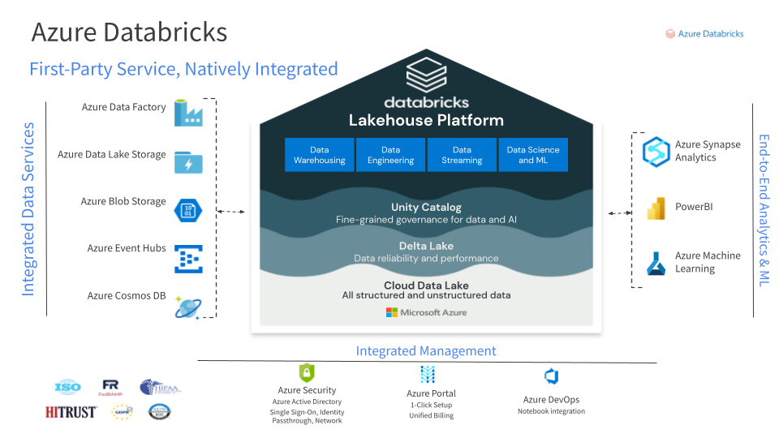

# Azure Databricks Essentials Demos

Demos showcased in the [Azure Databricks Essentials webinar](https://databricks.com/p/webinar/azure-databricks-essentials-series) for the Databricks Lakehouse Platform.

* `retail_demo` - used in **current (2022)** webinars
* `loans_demo` - used in webinars between **08/2021-03/2022**

| Option 1 | Option 2 |
| --- | --- |
|*Deploy new workspace in your RG with Storage Account and Secret Scope. Check out this repository to run demos like described [here](https://docs.microsoft.com/en-us/azure/databricks/repos/#clone-a-remote-git-repository).*  |**Use your existing Azure Databricks workspace** *with this Demo. Check out this repository to run demos like described [here](https://docs.microsoft.com/en-us/azure/databricks/repos/#clone-a-remote-git-repository) and use the local DBFS for data processing. * |

## Azure Databricks Lakehouse

## Deployment

